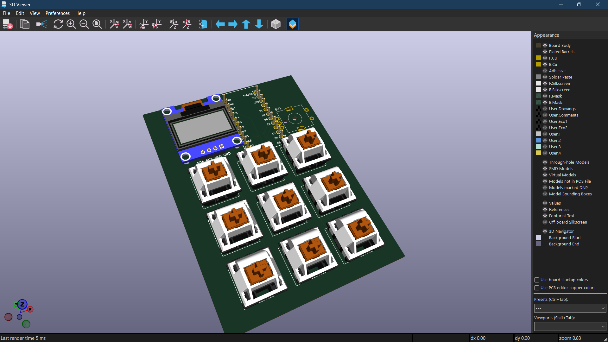
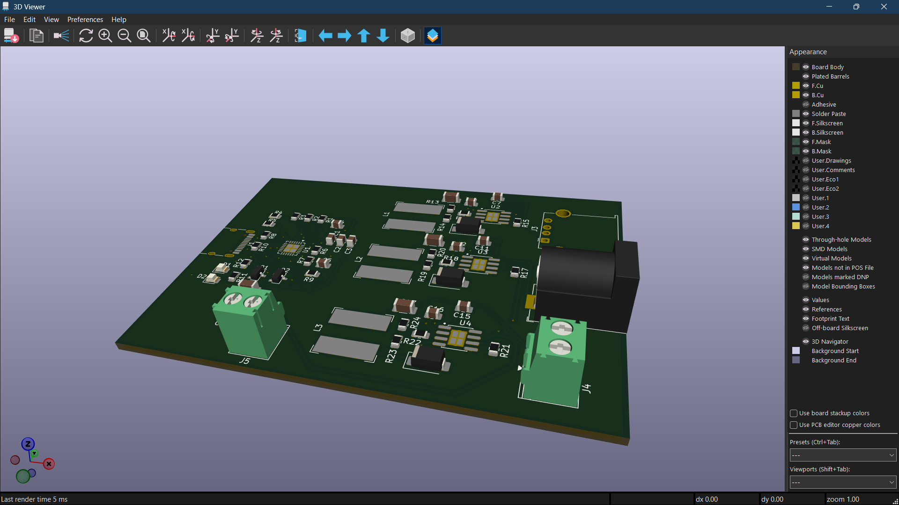

# PCB Design Portfolio

Custom hardware designs — from schematic capture to fabrication-ready Gerbers.

## Projects

### [Custom 65% Wireless Mechanical Keyboard](./keyboard-65-percent/)

A fully custom BLE mechanical keyboard designed from scratch. 67 keys + rotary encoder, wireless via nRF52840, OLED display, per-key backlight, USB-C charging, and a 3D-printable case.

**Skills demonstrated:** complex matrix design (6×12 with I/O expander), multi-IC schematic (nRF52840 + MCP23017), SMD + through-hole mixed assembly, 2-layer routing, parametric case design.

### [9-Key Macropad with OLED + Encoder](./macropad-9key/)

A compact USB macropad with a 3×3 switch grid, rotary encoder, and OLED display. Fully programmable via QMK firmware. PCB fits under 100×100mm for low-cost fabrication.

**Skills demonstrated:** efficient layout on constrained board area, USB HID device design, QMK-compatible schematic, compact case design.

### [USB-C Power Delivery Hub](./usb-c-pd-hub/)

A custom PCB that negotiates USB-C Power Delivery (20V/3A) and steps it down through three independent buck converters to provide 12V, 5V, and 3.3V outputs with automatic 5V fallback on negotiation failure.

**Skills demonstrated:** USB-C PD sink design (CYPD3177), buck converter feedback divider calculations, dual P-FET power path management, multi-rail regulation from single input.

## Tools & Skills

- **EDA:** KiCad 10 (schematic capture, PCB layout, Gerber export)
- **Autorouting:** Freerouting (Specctra DSN/SES workflow)
- **3D Modeling:** OpenSCAD (parametric enclosure design)
- **Firmware:** ZMK (wireless), QMK (USB)
- **Fabrication:** JLCPCB / LionCircuits process-ready designs
- **Protocols:** I2C, SPI, USB, BLE
- **Components:** nRF52840, ATmega32U4, MCP23017, SSD1306, EC11

## About

I design custom PCBs for keyboards, input devices, and embedded systems. Open to freelance projects — reach out via anidesh1208@gmail.com
