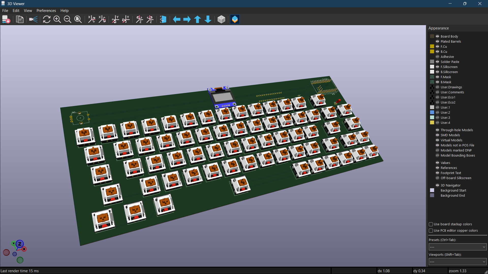

# Custom 65% Wireless Mechanical Keyboard

A fully custom Bluetooth mechanical keyboard designed from scratch in KiCad — from schematic to fabrication-ready Gerbers and a 3D-printable case.



## Features

- **67 mechanical switches** (MX-compatible) in a 65% layout with arrow keys and navigation column
- **Bluetooth Low Energy** via SuperMini NRF52840 (nice!nano compatible)
- **USB-C charging** with 3.7V LiPo battery (502030/503035)
- **Rotary encoder** for volume control with push-to-mute
- **SSD1306 OLED display** (128×64) showing layer, battery, and connection status
- **Per-key white LED backlight** with PWM brightness control via MOSFET
- **MCP23017 I/O expander** over I2C for additional GPIO (12 matrix columns)
- **Dual BLE profiles** for switching between two devices
- **ZMK firmware** compatible

## Technical Details

### Electrical Design

| Parameter | Value |
|-----------|-------|
| Matrix | 6 rows × 12 columns (via MCP23017) |
| Controller | SuperMini NRF52840 (18 GPIO) |
| I/O Expander | MCP23017-E/SP (I2C, address 0x20) |
| Display | SSD1306 128×64 OLED (I2C, address 0x3C) |
| Backlight | 67× white LEDs, N-MOSFET switched, PWM dimming |
| Battery | 3.7V LiPo, JST-PH connector, onboard charging |
| PCB | 2-layer, 1.6mm FR4, HASL finish |
| Board dimensions | 325mm × 120mm |

### I2C Bus Architecture

The MCP23017 and SSD1306 share a single I2C bus with 4.7kΩ pull-ups, allowing full matrix scanning and display updates without additional GPIO pins. This was a key design decision — the nRF52840's 18 GPIO pins would not have been sufficient for the 6×12 matrix, encoder, backlight, and display without the I/O expander.

### Matrix Design

The 67-key layout maps to a 6×12 electrical matrix. Physical rows 0–3 map directly to electrical rows 0–3 (12 keys each). Physical row 4 (bottom, 10 keys) maps to electrical row 4. Right-column overflow keys (=, Backspace, ], \, Del, Enter, BT, ↑, BL) are collected in electrical row 5. This arrangement minimizes trace routing complexity while using one fewer GPIO pin than a 5×14 matrix.

### Key Layout

```
[Esc][1][2][3][4][5][6][7][8][9][0][-][=][Backspace]
[Tab  ][Q][W][E][R][T][Y][U][I][O][P][ [ ][ ] ][\ ][Del]
[Caps   ][A][S][D][F][G][H][J][K][L][;]['][Enter  ][BT]
[Shift    ][Z][X][C][V][B][N][M][,][.][/][Shift][↑][BL]
[Ctrl][Win][Alt][      Space      ][Alt][Fn][Ctrl][←][↓][→]

Encoder: top-left (rotate = volume, push = mute)
OLED: top-center
USB-C: right side
```

## Design Challenges & Solutions

**GPIO shortage:** The nRF52840 has only 18 usable GPIO, but the design requires 23+ signals. Solved by adding an MCP23017 I2C I/O expander, which handles 12 matrix columns using only 2 GPIO pins (shared I2C bus with the OLED).

**Controller placement:** Through-hole controller pins conflict with switch pins on a compact PCB. Solved by dedicating a right-side panel area for the controller and support components, with the USB-C port accessible from the edge.

**Backlight on battery:** Per-key LEDs drain a LiPo battery quickly. Solved by using single-color white LEDs (lower power than RGB) with a MOSFET for complete shutdown, and PWM dimming to balance visibility with battery life.

## File Structure

```
keyboard-65-percent/
├── kicad/                    # KiCad project files
│   ├── Keyboard.kicad_sch    # Schematic
│   ├── Keyboard.kicad_pcb    # PCB layout
│   └── Keyboard.kicad_pro    # Project file
├── gerbers/                  # Fabrication files
│   └── Keyboard-gerbers.zip  # Ready for JLCPCB/LionCircuits
├── case/                     # 3D-printable enclosure
│   ├── keyboard_case.scad    # Bottom tray (OpenSCAD)
│   └── keyboard_top_plate.scad # Switch plate (OpenSCAD)
├── images/                   # Renders and screenshots
│   ├── 3d-render-front.png
│   ├── 3d-render-back.png
│   ├── schematic.png
│   └── pcb-layout.png
└── README.md
```

## Bill of Materials

| Component | Quantity | Package |
|-----------|----------|---------|
| SuperMini NRF52840 | 1 | Pro Micro footprint |
| MCP23017-E/SP | 1 | DIP-28 |
| SSD1306 OLED 0.96" | 1 | 4-pin I2C module |
| MX-compatible switches | 67 | Through-hole |
| 1N4148W diodes | 68 | SOD-123 |
| 2×3×4mm white LEDs | 67 | Through-hole |
| 1kΩ resistors | 67 | 0805 SMD |
| 4.7kΩ resistors | 2 | 0805 SMD |
| 10kΩ resistor | 1 | 0805 SMD |
| SI2302 MOSFET | 1 | SOT-23 |
| EC11 rotary encoder | 1 | Vertical, with switch |
| 3.7V LiPo battery | 1 | 502030/503035 |
| Plate-mount stabilizers | 1 set | 2u + 6.25u |

## Fabrication

- **PCB:** Upload `gerbers/Keyboard-gerbers.zip` to JLCPCB or LionCircuits. 2-layer, 1.6mm, HASL.
- **Case:** Open `.scad` files in OpenSCAD, export STL, print via any FDM 3D printing service.
- **Firmware:** ZMK with custom shield definition (keymap and matrix configuration).

## License

Open source hardware — MIT License.